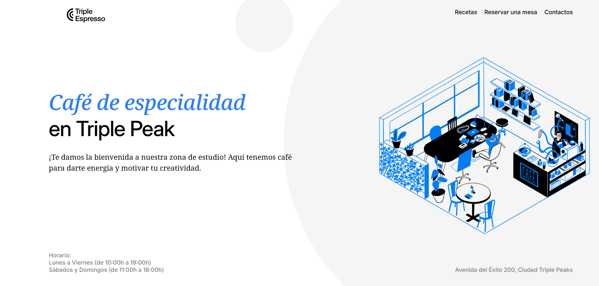
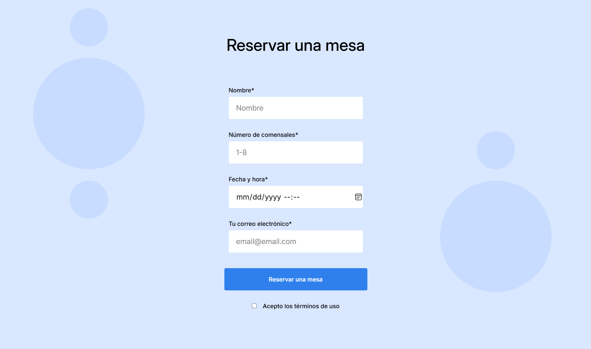

# Triple Espresso

## Description

Pagina de reserva para cafetería incluye horarios, recetas, e información de contacto; formulario incluido para reservar mesa. Construida con HTML y CSS

## Mejoras

Con la expansión de la cafetería es fundamental que los clientes puedan conocer los menus y tipos de servicio que se ofrecen en este exclusivo espacio, por ello se está trabajando en:

- **Menus/Menú:** Capacidad de albergar todo tipo de snacks y consumibles, incluyendo especiales e ingredientes/toppings que pueden agregar.

- **Servicios:** No cualquier cafetería ofrece la oportunidad de tener tu propio espacio de trabajo, o de reuniones (incluso si quieres celebrar un cumpleaños), etc. Por ello se agregará página para compartir los servicios y/o especialidades del lugar.

- **Reservations:** Futura posibilidad para agendar y recibir confirmación al correo/SMS.

- **BackEnd:** Futura posibilidad del personal de Cafetería de recibir ordenes, visualizarlas y marcarlas como entregadas/pendientes; así mismo como pedientes por agendar/confirmar; servicios y sus estados de igual manera. Posibilidad para hacer pagos en linea directamente desde la web para mayor comodidad al confirmar ordenes/servicios.
